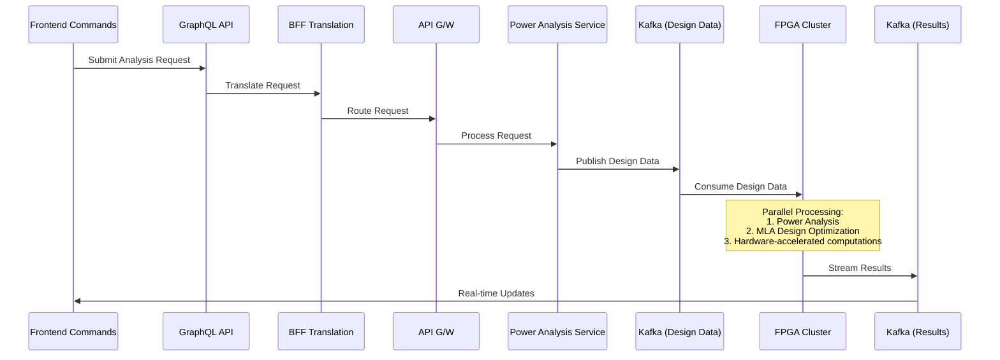

  <h1>AcceleraFPGA</h1>
  
  
High-Performance FPGA Acceleration Framework

  <!-- Badges - Replace URLs with your actual repository details -->
  
  
  
  
  

---

## 📑 Table of Contents
- [Overview](#overview)
- [Architecture Definition](#architecture-definition)
  - [Define the Architecture](#define-the-architecture)
  - [Frontend (React Dashboard)](#2-frontend-react-dashboard)
  - [GraphQL BFF (Backend for Frontend)](#3-graphql-bff-backend-for-frontend)
  - [Spring boot Microservices](#4-spring-boot-microservices)
  - [FPGA Integration](#5-fpga-integration)
  - [AWS Infrastructure](#6-aws-infrastructure)
  - [Event-Driven Communication](#7-event-driven-communication)
  - [Load Balancing and API Discovery](#8-load-balancing-and-api-discovery)
  - [AI/ML and Algorithms on FPGA](#9-aiml-and-algorithms-on-fpga)
  - [Testing and Deployment](#10-testing-and-deployment)
  - [Industry-Specific Customization](#11-industry-specific-customization)
  - [Documentation and Support](#12-documentation-and-support)
  - [Future Enhancements](#13-future-enhancements)
  - [Tools and Technologies](#tools-and-technologies)
- [Conceptual Worth](#conceptual-worth)
  - [Is This Worth It?](#is-this-worth-it)
    - [Yes, but with the right strategy](#yes-but-with-the-right-strategy)
  - [Can You Make a Business Out of This](#can-you-make-a-business-out-of-this)
    - [Yes, if you focus on the following](#yes-if-you-focus-on-the-following)
  - [Which Companies May Need This?](#which-companies-may-need-this)
    - [Australia](#australia)
    - [USA](#usa)
  - [How to Start?](#how-to-start)
  - [Enhanced Ideas to Broaden the Appeal](#enhanced-ideas-to-broaden-the-appeal)
    - [Multi-Cloud and Hybrid Cloud Support](#1-multi-cloud-and-hybrid-cloud-support)
    - [Edge Computing Integration](#2-edge-computing-integration)
    - [MLOps and AI/ML Pipeline Integration](#3-mlops-and-aiml-pipeline-integration)
    - [Blockchain Integration](#4-blockchain-integration)
    - [Real-Time Analytics and Visualization](#5-real-time-analytics-and-visualization)
    - [Cybersecurity Features](#6-cybersecurity-features)
    - [Low-Code/No-Code Interface](#7-low-codeno-code-interface)
    - [Industry-Specific Modules](#8-industry-specific-modules)
  - [Should You Patent the Idea?](#should-you-patent-the-idea)
    - [Pros of Patenting:](#pros-of-patenting)
    - [Cons of Patenting](#cons-of-patenting)
    - [ What to Patent](#what-to-patent)
    - [Alternatives to Patent](#alternative-to-patents)
  - [Can You Post This Idea Online?](#can-you-post-this-idea-online)
    - [Things to Avoid:](#things-to-avoid)
    - [Safe Ways to Share:](#safe-ways-to-share)
    - [Why Share?](#why-share)
  - [Industries You Can Target with Enhanced Capabilities](#industries-you-can-target-with-enhanced-capabilities)
  - [Next Steps](#next-steps)

- [Getting Started](#getting-started)
  - [Prerequisites](#prerequisites)
- [Usage](#usage)
- [Documentation](#documentation)
- [Examples](#examples)
- [Benchmarks](#benchmarks)
- [Contributing](#contributing)
- [License](#license)
- [Contact](#contact)

## 🌟 Overview

**AcceleraFPGA** is a **collaborative ecosystem** that seamlessly integrates **FPGA hardware** with **modern software stacks** to enable **low-latency, high-performance solutions** for compute-intensive workflows. Designed for industries like **semiconductor design, defence, fintech, and AI/ML**, this framework combines the **power of FPGA acceleration** with the **flexibility of microservices, GraphQL, and React** to create a unified platform for innovation.  

**Key Features:**  
✅ **React Frontend:** User-friendly dashboard for input/output.  
✅ **GraphQL BFF:** Unified API layer for seamless communication.  
✅ **Spring Boot Microservices:** Scalable backend for business logic and orchestration.  
✅ **FPGA Layer:** AI/ML acceleration and compute-intensive algorithms.  
✅ **Cloud-Native:** Leverages **AWS, Kafka, and Kubernetes** for scalability and event-driven workflows.  

**Why AcceleraFPGA?**  
✨ **Collaborative Ecosystem:** Built for developers, researchers, and enterprises to innovate together.  
✨ **Low-Latency Processing:** Ideal for real-time analytics, AI/ML inference, and high-frequency trading.  
✨ **Scalability:** Handles high workloads in cloud, edge, and hybrid environments.  
✨ **Industry-Ready:** Pre-built modules for semiconductor, defence, fintech, and AI/ML.  

**Use Cases:**  
🔹 **Semiconductor Design:** Accelerate EDA workflows and hardware simulations.  
🔹 **Defence and Aerospace:** Real-time signal processing and secure communication.  
🔹 **Fintech Trading:** Low-latency trading algorithms and real-time analytics.  
🔹 **AI/ML and Big Data:** Real-time inference, training, and data processing.  

## ✨ Architecture Definition
Creating a unified full-stack framework that integrates FPGA hardware with microservices, a GraphQL BFF (Backend for Frontend), and a React frontend is a complex but highly innovative project. Here’s a step-by-step guide to help you turn this idea into reality:

---

### **1. Define the Architecture**
The architecture will predominantly consist of the following layers:
- **React Frontend**: User interface for input/output.
- **GraphQL BFF**: Acts as a unified API layer for the frontend.
- **Spring Boot Microservices**: Handles business logic, orchestration, and communication with FPGA.
- **FPGA Layer**: Handles compute-intensive tasks (AI/ML, algorithms).
- **AWS Infrastructure**: Hosting, scaling, and event-driven communication.

---

### **2. Frontend (React Dashboard)**
- **Design the Dashboard**: Create a user-friendly dashboard for input (e.g., parameters for AI/ML models) and output (results from FPGA).
- **GraphQL Integration**: Use Apollo Client or React Query to interact with the GraphQL BFF.
- **Real-Time Updates**: Use WebSockets or GraphQL subscriptions for real-time updates from the backend.

---

### **3. GraphQL BFF (Backend for Frontend)**
- **Unified API Layer**: Use a GraphQL server (e.g., Apollo Server) to aggregate data from multiple microservices.
- **Schema Design**: Define a GraphQL schema that exposes all necessary queries and mutations for the frontend.
- **Caching**: Implement caching (e.g., Redis) to optimize performance.

---

### **4. Spring Boot Microservices**
- **Service Design**: Break down the backend into microservices (e.g., user management, FPGA orchestration, data processing).
- **FPGA Communication**: Use gRPC or REST APIs to send compute-intensive tasks to the FPGA.
- **Event-Driven Architecture**: Use Kafka for asynchronous communication between microservices and FPGA.
- **API Gateway**: Use AWS API Gateway or NGINX to route requests to the appropriate microservices.
- **Service Discovery**: Use AWS ECS or Kubernetes for service discovery and load balancing.

---

### **5. FPGA Integration**
- **FPGA Setup**: Use Xilinx or Intel FPGAs equipped with AI/ML accelerators.
- **Communication Protocol**: Use OpenCL, HLS (High-Level Synthesis), or custom RTL for FPGA programming.
- **Orchestration**: Create a dedicated microservice to manage FPGA task scheduling and result retrieval.
- **Scalability**: Use AWS F1 instances for FPGA scalability in the cloud.

---

### **6. AWS Infrastructure**
- **Compute**: Use EC2 instances for microservices and FPGA orchestration.
- **Storage**: Use S3 for storing large datasets and FPGA configurations.
- **Event-Driven**: Use Kafka or AWS Kinesis for event-driven communication.
- **Monitoring**: Use AWS CloudWatch for logging and monitoring.
- **Security**: Implement IAM roles, VPCs, and encryption for secure communication.

---

### **7. Event-Driven Communication**
- **Kafka Setup**: Use Kafka for event-driven communication between microservices and FPGA.
- **Event Topics**: Define Kafka topics for FPGA tasks, results, and notifications.
- **Consumer Groups**: Implement consumer groups for parallel processing.

---

### **8. Load Balancing and API Discovery**
- **NGINX/HAProxy**: Use these for load balancing and routing requests to microservices.
- **Service Mesh**: Consider using a service mesh like Istio for advanced traffic management and observability.

---

### **9. AI/ML and Algorithms on FPGA**
- **Model Deployment**: Use frameworks like TensorFlow Lite or PyTorch for deploying AI/ML models on FPGA.
- **Custom Algorithms**: Implement custom algorithms (e.g., fintech trading strategies) on FPGA.
- **Performance Optimization**: Optimize FPGA kernels for low latency and high throughput.

---

### **10. Testing and Deployment**
- **Unit Testing**: Write unit tests for microservices, GraphQL BFF, and FPGA communication.
- **Integration Testing**: Test the end-to-end flow from frontend to FPGA and back.
- **CI/CD Pipeline**: Use AWS CodePipeline or Jenkins for continuous integration and deployment.

---

### **11. Industry-Specific Customization**
- **Synopsys/Xilinx**: Focus on EDA (Electronic Design Automation) workflows and hardware simulation.
- **Defence**: Implement secure communication and edge computing use cases.
- **Fintech Trading**: Optimize for low-latency trading algorithms and real-time analytics.

---

### **12. Documentation and Support**
- **Developer Guide**: Provide detailed documentation for integrating new microservices or FPGA modules.
- **Support**: Offer 24/7 support for enterprise clients.

---

### **13. Future Enhancements**
- **Edge Computing**: Extend the framework to edge devices for low-latency applications.
- **Multi-Cloud Support**: Add support for Azure and GCP for hybrid cloud deployments.
- **AI/ML Pipeline**: Integrate MLOps tools for managing AI/ML models on FPGA.

---

### **Tools and Technologies**
- **Frontend**: React, Apollo Client, Material-UI.
- **GraphQL BFF**: Apollo Server, GraphQL Federation.
- **Backend**: Spring Boot, gRPC, Kafka.
- **FPGA**: Xilinx Vitis, Intel Quartus, OpenCL.
- **AWS**: EC2, S3, API Gateway, CloudWatch, Kafka (MSK).
- **Load Balancing**: NGINX, HAProxy.
- **CI/CD**: Jenkins, AWS CodePipeline.

---

By following this roadmap, a robust, scalable, and unified framework can be created that will eventually cater to industries like Synopsys, Xilinx, defence, and fintech trading companies.

  

push

## Conceptual Worth?
---

### **Is This Worth It?**
#### **Yes, but with the right strategy:**
1. **High Demand for Compute-Intensive Solutions**:
   - Industries like **defence, fintech, semiconductor design, and AI/ML** are increasingly relying on FPGA-based solutions for low-latency, high-performance computing.
   - The **convergence of hardware and software** in a unified framework is a **unique value proposition**.

2. **Emerging Trends**:
   - **Edge Computing**: Companies are moving towards edge computing for real-time analytics and decision-making.
   - **AI/ML Acceleration**: FPGAs are becoming popular for AI/ML inference and training due to their flexibility and performance.
   - **Unified Dashboards**: Enterprises are looking for **unified platforms** to manage complex workflows.

3. **Competitive Advantage**:
   - Integrating FPGA with a **modern tech stack (Spring Boot, React, GraphQL, AWS)** positions you as a **cutting-edge solution provider**.
   - Your framework can **reduce development time** for companies needing FPGA-based solutions.

4. **Challenges**:
   - **Complexity**: Integrating FPGA with software is technically challenging and requires expertise in both domains.
   - **Niche Market**: While the potential is high, the market is **specialized**, and you’ll need to target the right customers.
   - **Cost**: FPGAs and cloud infrastructure (AWS F1 instances) can be expensive, which may limit adoption to **enterprise clients**.

---

### **Can You Make a Business Out of This?**
#### **Yes, if you focus on the following:**
1. **Target Industries**:
   - **Semiconductor Design**: Companies like **Synopsys, Xilinx (now AMD), Intel, and Cadence** need FPGA-based solutions for EDA (Electronic Design Automation).
   - **Defence and Aerospace**: Defence contractors like **Lockheed Martin, Raytheon, and BAE Systems** use FPGAs for radar, signal processing, and secure communication.
   - **Fintech Trading**: High-frequency trading firms like **Citadel, Jane Street, and Two Sigma** need low-latency FPGA solutions for trading algorithms.
   - **AI/ML and Big Data**: Companies requiring **real-time AI/ML inference** (e.g., autonomous vehicles, healthcare, IoT).

2. **Geographical Focus**:
   - **USA**: Home to many semiconductor, defence, and fintech companies.
   - **Australia**: Growing demand for defence, fintech, and AI/ML solutions, with government and private sector investments.

3. **Business Model**:
   - **B2B SaaS**: Offer the framework as a **subscription-based service** with tiered pricing.
   - **Custom Solutions**: Provide **custom development** for enterprises with specific needs.
   - **Consulting and Support**: Offer consulting, training, and 24/7 support for enterprise clients.

4. **Scalability**:
   - Start with **niche use cases** (e.g., fintech trading or defence) and expand to other industries.
   - Leverage **AWS F1 instances** to offer FPGA-as-a-service in the cloud.

---

### **Which Companies May Need This?**
#### **Australia**:
1. **Defence and Aerospace**:
   - **BAE Systems Australia**
   - **Lockheed Martin Australia**
   - **Thales Australia**
2. **Fintech Trading**:
   - **IRESS**
   - **Macquarie Group**
   - **ASX (Australian Securities Exchange)**
3. **AI/ML and Big Data**:
   - **Atlassian** (for internal AI/ML workflows)
   - **Canva** (for AI/ML-based image processing)
4. **Research and Academia**:
   - **CSIRO (Commonwealth Scientific and Industrial Research Organisation)**
   - **Australian universities** with FPGA research labs.

#### **USA**:
1. **Semiconductor Design**:
   - **Synopsys**
   - **Xilinx (AMD)**
   - **Intel**
   - **Cadence Design Systems**
2. **Defence and Aerospace**:
   - **Lockheed Martin**
   - **Raytheon Technologies**
   - **Northrop Grumman**
3. **Fintech Trading**:
   - **Citadel**
   - **Jane Street**
   - **Two Sigma**
   - **Goldman Sachs**
4. **AI/ML and Big Data**:
   - **Google** (for AI/ML acceleration)
   - **Amazon** (for AWS F1 instances)
   - **Tesla** (for autonomous vehicle AI/ML)

---

### **How to Start?**
1. **Proof of Concept (PoC)**:
   - Build a **small-scale PoC** targeting one industry (e.g., fintech trading or defence).
   - Showcase the **speed and efficiency** of FPGA integration compared to traditional solutions.

2. **Partnerships**:
   - Partner with **FPGA vendors** (Xilinx, Intel) and cloud providers (AWS) to reduce costs and gain credibility.
   - Collaborate with **industry-specific consultants** to understand customer needs.

3. **Go-to-Market Strategy**:
   - Focus on **enterprise sales** and target decision-makers (CTOs, CIOs).
   - Attend **industry conferences** (e.g., FPGA World, FinTech Innovation Lab).

4. **Funding**:
   - Seek **seed funding** or grants (e.g., Australian government grants for innovation).
   - Pitch to **venture capitalists** with a focus on deep tech and enterprise software.

---

### **Enhanced Ideas to Broaden the Appeal**
Here are some **additional capabilities** you can integrate to make your framework more versatile and appealing to a wider audience:

---

#### **1. Multi-Cloud and Hybrid Cloud Support**
- **Why?** Many enterprises use a mix of on-premise, private cloud, and public cloud infrastructure.
- **How?** Add support for **AWS, Azure, GCP, and on-premise FPGA deployments**.
- **Benefit:** Attract companies with hybrid cloud strategies.

---

#### **2. Edge Computing Integration**
- **Why?** Industries like IoT, autonomous vehicles, and healthcare need real-time processing at the edge.
- **How?** Extend the framework to **edge devices** (e.g., NVIDIA Jetson, Raspberry Pi with FPGA modules).
- **Benefit:** Cater to IoT and edge computing markets.

---

#### **3. MLOps and AI/ML Pipeline Integration**
- **Why?** Companies need end-to-end AI/ML solutions, from training to deployment.
- **How?** Integrate **MLOps tools** (e.g., MLflow, Kubeflow) for managing AI/ML models on FPGA.
- **Benefit:** Attract AI/ML-driven industries like healthcare, retail, and manufacturing.

---

#### **4. Blockchain Integration**
- **Why?** Fintech and supply chain companies need secure, transparent transactions.
- **How?** Use FPGA to accelerate **blockchain operations** (e.g., cryptographic hashing, smart contracts).
- **Benefit:** Expand into fintech, supply chain, and blockchain-based industries.

---

#### **5. Real-Time Analytics and Visualization**
- **Why?** Companies need actionable insights from data in real-time.
- **How?** Add **real-time analytics** (e.g., Apache Flink, Spark Streaming) and **data visualization tools** (e.g., Tableau, Power BI integration).
- **Benefit:** Attract industries like retail, logistics, and energy.

---

#### **6. Cybersecurity Features**
- **Why?** Defence, fintech, and healthcare industries require robust security.
- **How?** Use FPGA for **encryption, decryption, and intrusion detection**.
- **Benefit:** Appeal to security-conscious industries.

---

#### **7. Low-Code/No-Code Interface**
- **Why?** Enterprises want to empower non-technical users to create workflows.
- **How?** Add a **low-code/no-code interface** for configuring FPGA workflows and microservices.
- **Benefit:** Attract SMBs and non-tech enterprises.

---

#### **8. Industry-Specific Modules**
- **Why?** Tailoring the framework to specific industries increases adoption.
- **How?** Create **pre-built modules** for industries like healthcare (medical imaging), logistics (route optimization), and energy (predictive maintenance).
- **Benefit:** Faster deployment and industry-specific appeal.

---

### **Should You Patent the Idea?**
Patenting can protect your intellectual property, but it’s not always straightforward. Here’s a breakdown:

#### **Pros of Patenting:**
1. **Protection:** Prevents competitors from copying your idea.
2. **Credibility:** Adds value to your business and attracts investors.
3. **Monetization:** You can license the technology to other companies.

#### **Cons of Patenting:**
1. **Cost:** Patenting can be expensive (legal fees, filing costs).
2. **Time:** The process can take years.
3. **Complexity:** Your idea must be novel, non-obvious, and useful.

#### **What to Patent?**
- **Unique Workflows:** The integration of FPGA with microservices and GraphQL BFF.
- **Algorithms:** Any proprietary algorithms running on FPGA.
- **Architecture:** The overall system architecture.

#### **Alternative to Patents:**
- **Trade Secrets:** Keep the implementation details confidential.
- **Open Source:** Release parts of the framework as open source to build a community and establish thought leadership.

---

### **Can You Post This Idea Online?**
Yes, but with caution. Here’s how to approach it:

#### **Things to Avoid:**
- **Detailed Implementation:** Don’t share specific algorithms, code, or workflows.
- **Business Plan:** Avoid sharing your go-to-market strategy or financial projections.

#### **Safe Ways to Share:**
1. **High-Level Concept:** Describe the idea in broad terms (e.g., “A unified framework integrating FPGA with microservices and GraphQL”).
2. **Thought Leadership:** Write blogs or articles about the **problem you’re solving** without revealing the solution.
3. **Community Engagement:** Discuss trends in FPGA, microservices, and GraphQL to build credibility.

#### **Why Share?**
- **Feedback:** Get input from experts and potential customers.
- **Visibility:** Attract investors, partners, and early adopters.
- **Validation:** Gauge interest in the idea before investing heavily.

---

### **Industries You Can Target with Enhanced Capabilities**
1. **Healthcare:**
   - Medical imaging, genomics, and real-time patient monitoring.
2. **Retail:**
   - Personalized recommendations, inventory optimization, and fraud detection.
3. **Energy:**
   - Predictive maintenance, smart grid optimization, and renewable energy forecasting.
4. **Logistics:**
   - Route optimization, fleet management, and supply chain analytics.
5. **Gaming:**
   - Real-time rendering, physics simulation, and AI-driven NPCs.
6. **Telecom:**
   - Network optimization, 5G signal processing, and edge computing.

---

### **Next Steps**
1. **Build a Prototype:** Start with a small-scale PoC targeting one industry.
2. **Validate the Market:** Talk to potential customers and gather feedback.
3. **Secure Funding:** Pitch to investors or apply for grants.
4. **Protect IP:** Consult a patent attorney to explore patenting options.
5. **Build a Community:** Share high-level ideas online to attract interest and collaborators.

---

### **Final Thoughts**
The idea has **tremendous potential**, especially with the enhancements suggested. By broadening its capabilities, you can cater to **multiple industries** and create a **scalable business**. While patenting can protect your IP, focus on **execution and market validation** first. Share the idea **strategically online** to build momentum without revealing sensitive details. Good luck! 🚀

## Example - Power Analysis Architectural Flow

### Frontend (React + GraphQL)
1. Power analysis dashboard where user input the data or command
2. Real-time visualization of power hotspots
3. Interactive power density maps

### BFF
1. GraphQL resolver translates UI commands to API Calls
2. Subscription handling for real-time updates
3. Request validation and authentication

### API Gateways
1. Routes requests to appropriate microservices
2. Rate Limiting and throttling 
3. JWT token validation (OAUTH2.0 and OIDC)

### Load Banalcer (HAProxy)
1. Distributes the traffic across service instances
2. Health Check
3. SSL Termination

### Microservices (Spring boot)
1. Design Parser Service: Parse IC Design Files
2. Power Analysis Service: Initial Power Calculations
3. Optimization Service: Coordinates Optimization tasks
4. Results Aggregrator Service: Collects and formats results

### Message Bus (Kafka)
1. Topics for design block data
2. Power analysis results
3. Optimization commands
4. Real-time Updates

### Database
1. PostgreSQL: Design metadata, User data
2. MongoDB: Design block structures
3. InfluxDB: Time-Series power measurements
4. Redis: Caching frequently accessed designs

### FPGA Accelerations
1. Power analysis matrix computations
2. Parallel Optimization algorithms
3. Machine learning model for power prediction 
4. Custom hardware accelerations for power estimation

## Processing Flow of the Power Analysis Example

## 🚀 Getting Started

### Prerequisites

- Xilinx Vivado Design Suite 2023.1 or later
- Python 3.8+
- CMake 3.15+
- Modern C++ Compiler (GCC 9+ or Clang 10+)
